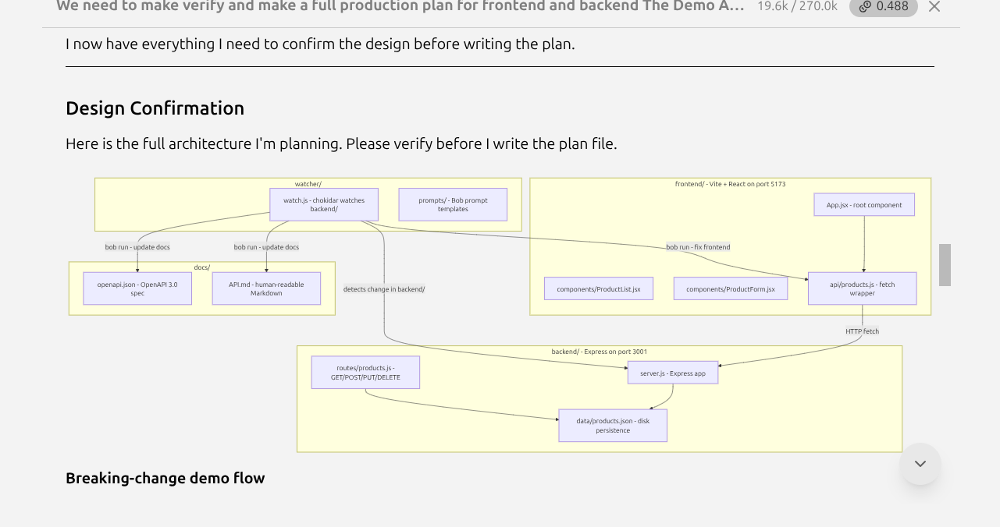
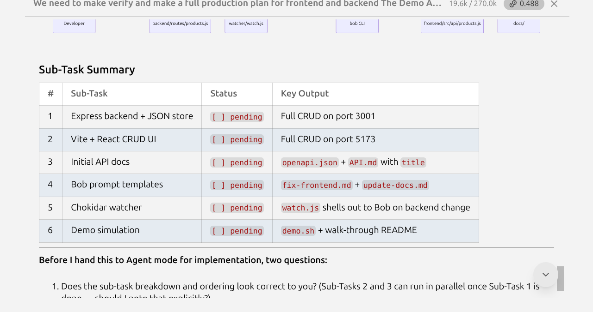
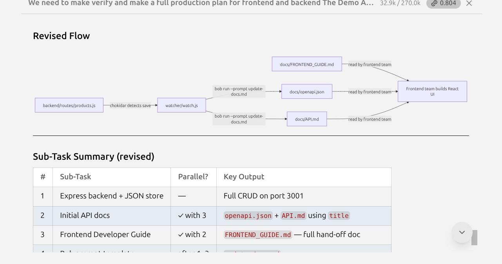
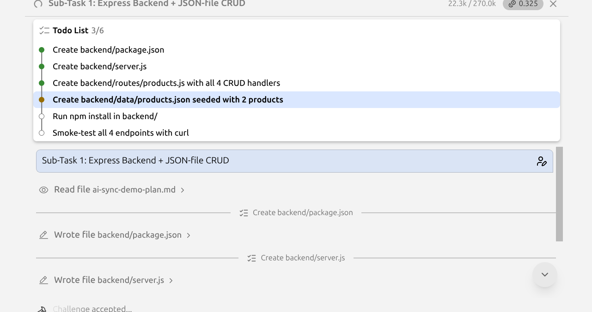
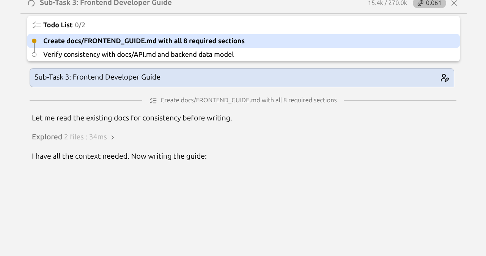
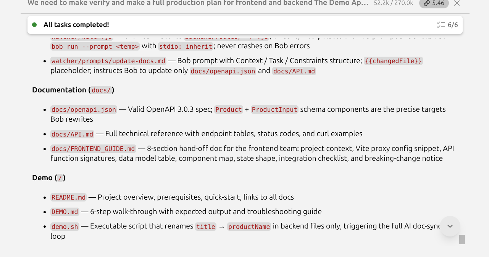
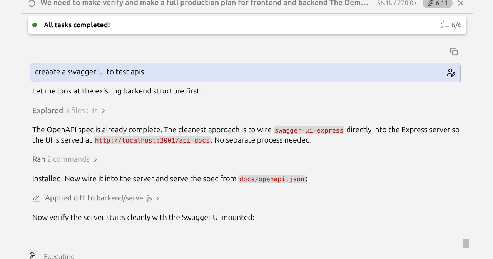
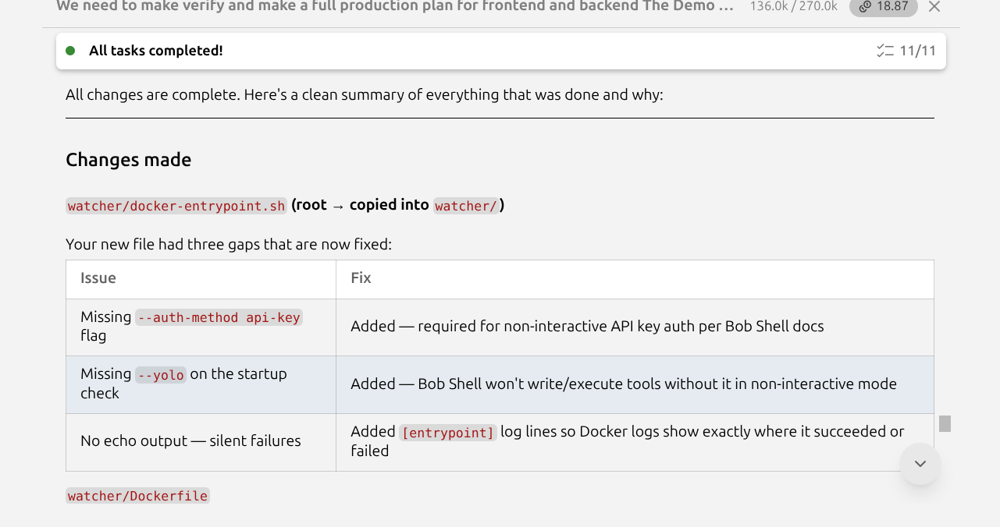

# AI Sync Demo — Product Catalog

This repository is a miniature backend sandbox paired with an AI-powered documentation pipeline. An Express API serves a simple product catalog; a chokidar watcher monitors backend route files and, whenever a change is saved, passes the changed file to IBM Bob Shell so it can automatically regenerate the OpenAPI spec and the human-readable API reference — without any manual documentation work.

---

## Built with IBM Bob

This entire project — architecture, code, documentation, and Docker setup — was planned and implemented collaboratively with **IBM Bob** inside the IDE. The screenshots below show the actual Bob sessions from each phase.

### Phase 1 — Architecture & Planning

Bob proposed the full system architecture, confirmed the design with the team, and wrote the production plan file before a single line of code was touched.







---

### Phase 2 — Backend & Docs Development

Bob implemented the Express CRUD backend, the OpenAPI spec, the API reference, and the frontend developer guide as independent sub-tasks — each with its own tracked todo list.







---

### Phase 3 — Swagger UI & Dockerization

Bob added Swagger UI to the running Express server in a single turn, then Dockerized both services with a shared compose file, structured logging, and a hardened entrypoint script.





---

## Prerequisites

| Requirement | Version |
|---|---|
| [Node.js](https://nodejs.org/) | ≥ 18 |
| IBM Bob CLI | installed and available as `bob` on `PATH` |

Verify both before continuing:

```bash
node --version   # should print v18.x.x or higher
bob --version    # should print the Bob CLI version
```

---

## Repository Layout

```
Bridge-Forage-hackathon/
├── backend/
│   ├── Dockerfile            # production image for the API server
│   ├── package.json          # express, cors, uuid; nodemon devDep
│   ├── server.js             # Express app entry point, port 3001
│   ├── routes/
│   │   └── products.js       # GET / POST / PUT / DELETE handlers
│   └── data/
│       └── products.json     # seeded with Widget A + Widget B
├── watcher/
│   ├── Dockerfile            # production image for the watcher
│   ├── package.json          # chokidar dependency
│   ├── watch.js              # chokidar watcher → bob -p
│   ├── .env.example          # copy to watcher/.env and fill in BOBSHELL_API_KEY
│   └── prompts/
│       └── update-docs.md    # Bob prompt template with {{changedFile}}
├── docs/
│   ├── openapi.json          # OpenAPI 3.0.3 machine-readable contract
│   ├── API.md                # human-readable technical reference
│   └── FRONTEND_GUIDE.md     # frontend team hand-off guide (static)
├── docker-compose.yml        # orchestrates backend + watcher on a single VPS
├── demo.sh                   # applies the breaking change: title → productName
├── demo-reset.sh             # restores title ← productName (repeat the demo)
├── DEMO.md                   # step-by-step demo walk-through
└── README.md                 # this file
```

---

## Quick Start

### 1. Start the backend

```bash
cd backend && npm install && npm run dev
```

The API server starts on **port 3001** via nodemon and reloads automatically on any file save.

### 2. Start the watcher _(new terminal)_

```bash
cd watcher && npm install && node watch.js
```

The watcher monitors `backend/routes/` and triggers `bob -p` on any file save, regenerating `docs/API.md` and `docs/openapi.json` automatically.

---

## Docker (VPS deployment)

Both services can be run together on a single VPS using Docker Compose.

### Prerequisites

- Docker ≥ 24 and Docker Compose v2 installed on the host
- IBM Bob Shell available inside the watcher image (see [`watcher/Dockerfile`](watcher/Dockerfile) for options)
- A Bob API key for non-interactive use

### Setup

```bash
# 1. Copy the example env file and fill in your Bob API key
cp watcher/.env.example watcher/.env
# Edit watcher/.env and set BOBSHELL_API_KEY=<your key>

# 2. Build and start both services
docker compose up --build -d

# 3. Tail logs
docker compose logs -f
```

The backend API will be reachable at `http://<vps-ip>:3001`.
The Swagger UI will be at `http://<vps-ip>:3001/api-docs`.

### Volumes

| Host path | Container path | Purpose |
|---|---|---|
| `./backend/data` | `/app/data` | Persists `products.json` across restarts |
| `./docs` | `/app/../docs` | Watcher writes regenerated docs here; backend serves `openapi.json` from here |
| `./backend/routes` | `/app/../backend/routes` | Watcher reads route files (read-only) |

### Stopping

```bash
docker compose down
```

---

## Documentation

| File | Description |
|---|---|
| [`docs/API.md`](docs/API.md) | Human-readable technical reference — all endpoints, request/response shapes, curl examples, and the current data model |
| [`docs/openapi.json`](docs/openapi.json) | Machine-readable OpenAPI 3.0.3 contract — suitable for import into Postman, Swagger UI, or any code-generation tool |
| [`docs/FRONTEND_GUIDE.md`](docs/FRONTEND_GUIDE.md) | Standalone guide for the frontend team — tech stack, component map, integration checklist, and breaking-change notice |

---

## Demo

See [DEMO.md](DEMO.md) for a step-by-step walk-through of the breaking-change simulation.
